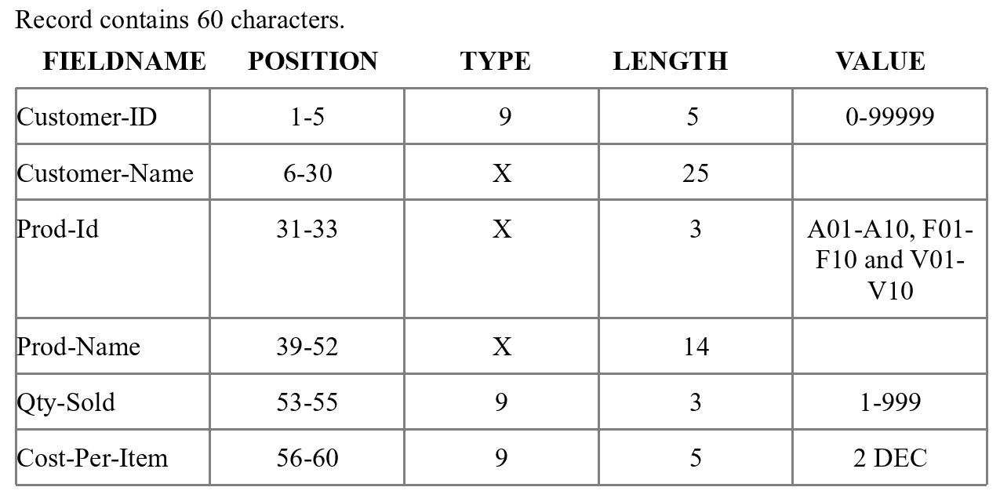

COBOL SALES INVENTORY REPORT DEMO 
======================

This project demonstrates creating a sales report from PR2FA17.TXT
and then creates SALES REPORT.txt which displays data on how many
sales a certain item got per store, total amount of an item sold
throughout all stores, displays the amount of cash in-flow from 
sales per store and based on all together, and grand totals for
the entire company in all inventory sales and cash in-flow.

# Program Inputs Taken From PR2FA17.TXT

* Customer-ID
* Customer-Name
* Prod-Id
* Prod-Name
* Qty-Sold
* Cost-Per-Item

# File Structure

# INFO

*See GitHub:* https://github.com/tylerbro93/

